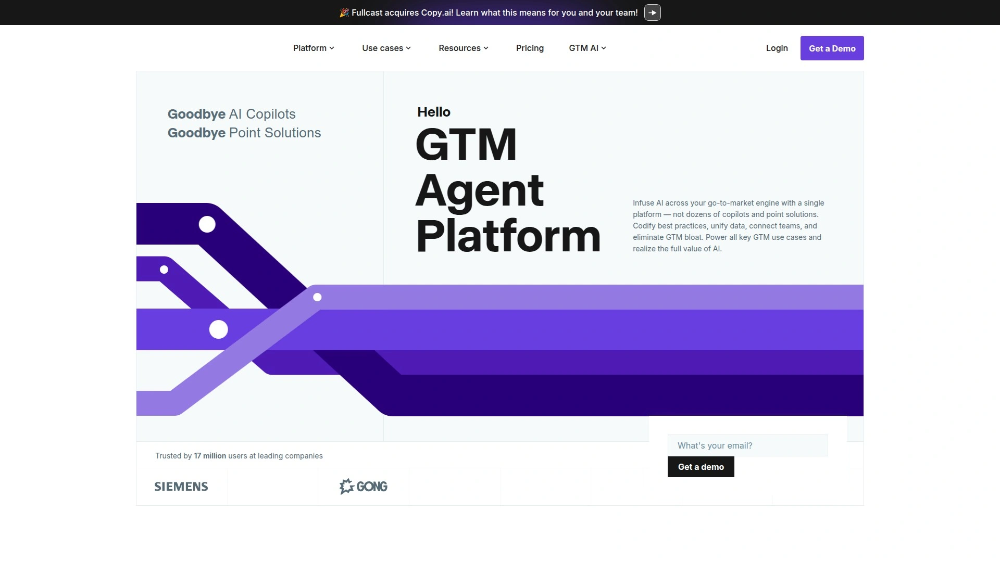

# Top 28 AI Blog Writing Tools Ranked in 2025 (Latest Compilation)

Finding the right AI blog writing tool can feel overwhelming when you're staring at a blank screen wondering how you'll hit your content deadlines. Whether you're running a personal blog, managing content for clients, or building a content marketing empire, the right AI writing assistant can transform hours of work into minutes while keeping your voice authentic and your SEO on point.

This guide walks you through the best AI-powered content creation platforms available today, from full-featured blogging suites to specialized optimization tools. Each platform brings something unique to the table, whether it's automated blog post generation, smart SEO scoring, or seamless publishing workflows.

---

## **[RightBlogger](https://rightblogger.com)**

Your complete blogging automation platform with unlimited AI content creation.

RightBlogger positions itself as an all-in-one solution specifically designed for bloggers who want to scale content without sacrificing quality. The platform offers unlimited usage across all its tools, which is rare in the AI writing space where most competitors charge per word or impose monthly limits.

The standout feature is the Article Writer that generates full SEO-optimized blog posts in minutes, complete with proper structure and keyword integration. What makes RightBlogger particularly valuable is its Video to Blog Post converter, allowing you to repurpose YouTube videos and podcasts into written content automatically. The platform includes over 80 AI-powered tools covering everything from keyword research to content rewriting.

RightBlogger also offers seamless one-click publishing to WordPress, Webflow, and Ghost, eliminating the tedious copy-paste workflow. The MyTone feature learns your writing style so generated content actually sounds like you. For bloggers who produce high volumes of content, the unlimited plan means you can generate 100 articles this month without worrying about additional costs. The Smart Suggest tool analyzes your existing site to recommend content ideas that will actually perform.

---

## **[Jasper](https://www.jasper.ai)**

Enterprise-grade AI writing platform with advanced brand voice controls and collaboration features.

Jasper built its reputation as one of the most powerful AI content platforms for businesses and marketing teams. The platform excels at maintaining brand consistency across all content through its sophisticated brand voice technology, which analyzes your existing content and replicates your unique style across everything it generates.

What sets Jasper apart is its Power Mode feature, which allows you to string together multiple templates into comprehensive workflows. You can create an entire blog post workflow that generates an intro, body paragraphs, and conclusion in sequence. The platform integrates seamlessly with SurferSEO, providing real-time optimization suggestions as you write. Jasper supports over 50 content templates and can generate content in 30+ languages.

The collaboration features make Jasper ideal for teams, with workspace management, shared templates, and custom workflows. However, it comes at a premium price point starting at $49/month for basic features, with AI functionality adding an extra $50/month. For established businesses with budget flexibility who need enterprise-level features, Jasper delivers exceptional quality, though smaller creators might find more affordable options elsewhere.

---

## **[Writesonic](https://writesonic.com)**

Fast AI article generation with built-in SEO tools and affordable pricing for high-volume creators.

Writesonic positions itself as the more affordable alternative to premium AI writers while maintaining competitive quality. The platform can generate articles up to 1500 words in approximately 30 seconds, making it one of the fastest options available. It integrates directly with Semrush for keyword research and content optimization, providing a complete SEO workflow within the platform.

The Article Writer 5.0 allows you to upload reference articles that the AI uses as inspiration for tone and structure. Chatsonic, their conversational AI chatbot, functions like ChatGPT but with additional features like web browsing for current information and the ability to generate AI images through Photosonic. The platform supports 24 languages and offers a free tier with 10,000 words per month using GPT-3.5.

One limitation users report is that the brand voice feature doesn't always capture nuances consistently, even when you provide examples. The platform works best for straightforward informational content rather than highly stylized pieces. Pricing starts at lower tiers than competitors, making it accessible for solopreneurs and small businesses who need to produce content at scale without enterprise budgets.

---

## **[Copy.ai](https://www.copy.ai)**

Marketing-focused AI platform designed for go-to-market teams needing both sales and marketing content.

Copy.ai evolved from a simple copywriting tool into a comprehensive GTM AI platform. It excels at generating short-form marketing copy, social media content, and ad copy faster than most alternatives. The platform offers unlimited words on paid plans and includes workflow automation features that let you create sequences of content generation steps.

What makes Copy.ai unique is its focus on not just content creation but also sales prospecting, CRM data enrichment, and marketing workflows. The platform includes templates for everything from product descriptions to email campaigns. For content marketers running multi-channel campaigns, Copy.ai can generate consistent messaging across all platforms.

The downside is that Copy.ai struggles more with long-form blog content compared to tools specifically built for articles. Users report that it works best for quick marketing copy, social posts, and ad text rather than 2000-word SEO blog posts. The platform offers recipe sequences where you can save instructions and reuse them, though it lacks the custom template creation available in competitors like Jasper. Pricing starts at $49/month for the Starter plan with unlimited chats but limited workflows.

---

## **[Surfer SEO](https://surferseo.com)**

Industry-leading content optimization tool that analyzes top-ranking pages to guide your writing.

Surfer SEO isn't primarily a writing tool but rather a content optimization powerhouse that tells you exactly what your articles need to rank. The Content Editor analyzes the top 10-20 results for your target keyword and provides detailed recommendations on word count, keyword density, headings structure, and NLP terms to include.

The platform's real-time scoring system updates as you write, showing you exactly where your content stands compared to top competitors. Surfer AI, their content generation add-on, can write complete articles optimized for your target keywords, though this requires an additional monthly fee. The SERP Analyzer provides detailed competitive insights showing what's working for top-ranking pages.

Many content teams use Surfer alongside other AI writers, generating drafts in tools like Jasper or Writesonic then optimizing them in Surfer. The platform integrates with Google Docs, WordPress, and other writing environments. One criticism is that blindly following Surfer's suggestions can lead to keyword-stuffed, unnatural content, so it requires editorial judgment. Pricing starts at $89/month for essential features, with AI content generation adding $50/month for 5 articles.

---

## **[Frase](https://www.frase.io)**

Content research and SEO optimization platform focused on competitive analysis and content briefs.

Frase specializes in content research and brief creation, analyzing the SERP to tell you exactly what topics, questions, and keywords your content should cover. The platform's content brief generator pulls data from top-ranking pages and organizes it into actionable outlines, making it easy for writers to understand what content needs to include.

The AI Writer in Frase can generate paragraphs, introductions, conclusions, and full articles based on your brief. The tool excels at pulling questions from the "People Also Ask" section and suggesting answers. Unlike Surfer which focuses on optimization, Frase emphasizes research and planning stages of content creation.

Frase integrates with WordPress and Google Docs, allowing you to work within your preferred environment. The content scoring system is similar to Surfer but generally considered less comprehensive. Where Frase truly shines is in content brief creation for writers, whether in-house or freelance. The platform helps standardize content creation across teams by providing clear, data-driven briefs. Pricing starts at $15/month for basic features, making it more affordable than Surfer while offering solid SEO guidance for content creators on tighter budgets.

---

## **[Rytr](https://rytr.me)**

Budget-friendly AI writing assistant with generous free tier and simple interface for beginners.

Rytr stands out for its exceptional affordability and generous free plan offering 10,000 characters per month. The platform uses GPT-3 technology to generate content across 40+ use cases, from blog posts to product descriptions. It supports over 30 languages and offers 20+ tone options, making it versatile for different content needs.

The "My Voice" feature allows Rytr to learn and replicate your writing style, ensuring brand consistency. The platform includes a Chrome extension so you can generate content anywhere you write online. The rich text editor allows you to reword, shorten, or expand text with simple commands. Rytr also includes a built-in plagiarism checker via Copyscape integration.

What makes Rytr particularly appealing is the unlimited plan at just $29/month, providing unlimited character generation without complex credit systems. The platform works best for shorter content pieces, emails, social media posts, and blog sections rather than full 2000+ word articles. For beginners exploring AI writing or freelancers on tight budgets, Rytr offers exceptional value. The interface is straightforward without overwhelming users with advanced features, though power users might find it limiting compared to more feature-rich alternatives.

---

## **[GravityWrite](https://gravitywrite.com)**

Comprehensive AI content tool with 100+ templates covering diverse content types and categories.

GravityWrite leverages advanced natural language processing to generate content across multiple categories quickly. The platform offers more than 100 AI-powered tools covering everything from blog content to social media posts, product descriptions, ad copy, and website content. This variety makes it versatile for different content creation needs.

The platform features an instant article writer capable of generating quality articles within minutes. It specializes in creating SEO-friendly content with built-in optimization suggestions. GravityWrite also generates AI images to accompany your content and includes tools for social media post optimization designed to boost engagement.

The interface is designed for ease of use, allowing users to jump in and start creating without extensive learning curves. GravityWrite offers a 5-day trial for just $1, letting you test the platform before committing. Solo plans begin at $14.99/month with limitations on article creation. While the platform covers many content types, some users report that generated content can feel generic and requires significant editing to add personality and unique perspectives.

---

## **[Scalenut](https://scalenut.com)**

All-in-one AI SEO and content marketing platform with Cruise Mode for guided content creation.

Scalenut combines keyword research, content planning, AI writing, and optimization into one comprehensive platform. The standout feature is Cruise Mode, which guides you through the entire blog post creation process from keyword selection through outline building to final content generation. This step-by-step approach makes it particularly beginner-friendly.

The platform analyzes SERPs in real-time to provide data-driven recommendations on content structure, topics to cover, and keywords to target. The Content Optimizer analyzes your content against 200+ SEO factors and provides actionable improvement suggestions. Scalenut includes a Traffic Analyzer that connects to Google Search Console and displays insights directly in the app.

The keyword planner helps identify relevant keyword clusters and estimates traffic potential. For content teams and agencies producing large volumes of SEO content, Scalenut offers end-to-end workflow support. However, some users report that the generated content quality is on par with basic chatbots and lacks the nuanced voice of premium AI writers. The AI content requires substantial editing to feel authentic and engaging. Pricing starts at $39/month with a 7-day free trial, positioning it in the mid-range for AI content platforms.

---

## **[NeuronWriter](https://neuronwriter.com)**

SEO-focused content editor with NLP analysis and affordable pricing including lifetime deals.

NeuronWriter specializes in content optimization using natural language processing to analyze top-ranking competitors. The platform provides real-time SEO scoring as you write, along with suggestions for NLP terms, keyword density, and content structure. It excels at showing you exactly what terms and topics appear frequently in top-ranking content.

The content editor includes AI-powered writing assistance to generate headers, questions, and full paragraphs. NeuronWriter offers one-click WordPress import/export functionality, streamlining the publishing workflow. The SERP analysis tools provide detailed insights into competitor content strategies, helping you understand what's working in your niche.

One of NeuronWriter's biggest advantages is its pricing structure. The Bronze plan starts at just $23/month with 25 content analyses. The platform also offers lifetime deals through various platforms, providing exceptional long-term value. The interface is clean and intuitive, making it accessible even for those new to SEO tools. However, it lacks some broader features like built-in plagiarism checking. NeuronWriter works best for bloggers and content creators focused on precision SEO optimization rather than those needing comprehensive content marketing suites.

---

## **[Narrato](https://narrato.io)**

Full-stack AI content workspace combining writing, planning, optimization, collaboration, and publishing.

Narrato offers over 100 AI tools and templates covering every stage of content creation from ideation through publication. The AI Content Genie stands out as a unique feature—it's essentially an autopilot for content that automatically generates weekly social media and blog posts based on your website URL and chosen themes. Just set it up once and receive fresh content every week.

The platform automatically generates SEO content briefs with keyword suggestions, questions to answer, reference links, and optimization parameters. Narrato includes an AI article generator, content rewriter, paraphraser, and readability checker. You can create custom AI templates tailored to your specific content needs beyond the pre-built options.

What sets Narrato apart is its emphasis on project management and collaboration. Teams can work together with custom workflows, automated tasks, and stakeholder collaboration features. The platform publishes directly to Instagram, LinkedIn, Facebook, Webflow, and WordPress. For content teams and agencies managing multiple clients and writers, Narrato provides comprehensive workflow management alongside powerful AI tools. Pricing starts at $48/month for the Pro plan with 400,000 characters monthly.

---

## **[Anyword](https://anyword.com)**

Data-driven copywriting platform with predictive performance scores for marketing content.

Anyword uses AI and machine learning to not only generate copy but predict how it will perform before you publish. The platform analyzes past data and provides performance scores for different variations, helping you choose the most effective messaging. This data-driven approach helps content creators see 20-30% increases in conversion rates.

The platform generates content for all marketing channels including ad copy, landing pages, blog posts, emails, and social media. Anyword specializes in creating highly effective ad copy for social platforms. The Blog Wizard tool helps craft titles, outlines, and complete articles optimized for engagement.

Anyword allows you to define your brand voice and target audience profiles, then generates content tailored to those parameters. The predictive scoring helps remove guesswork from content decisions. However, Anyword is more expensive than many alternatives, starting at $49/month for the Starter plan with the full capabilities requiring the Business plan at $99/month. It's best suited for serious content creators and businesses focused on conversion optimization rather than casual bloggers or those primarily focused on SEO rankings.

---

## **[StoryChief](https://storychief.io)**

Content marketing platform with AI writing, multichannel publishing, and campaign management.

StoryChief combines AI-powered content creation with comprehensive distribution and analytics. The platform's AI assistant, William, helps generate blog posts, press releases, social media content, and other marketing materials. It includes multilingual AI capabilities, brand voice studio, and SEO strategy planning tools.

The platform shines in its one-click publishing feature, allowing you to distribute content across multiple channels simultaneously. The social media scheduling capabilities let you plan campaigns weeks in advance. StoryChief includes a 24/7 AI assistant for ongoing support. The content calendar generation automatically creates strategic calendars with 20+ AI-powered prompts.

What makes StoryChief valuable for marketing teams is the integration of creation, distribution, and performance tracking in one platform. You can generate a blog post, transform it into social media content, schedule posts across platforms, and track performance all within the same tool. However, for users solely focused on AI writing quality, specialized tools like Jasper may produce better raw content. StoryChief works best for teams managing complete content marketing operations across multiple channels.

---

## **[Koala Writer](https://koalawriter.com)**

AI writing tool optimized for SEO with real-time data integration and multiple AI models.

Koala Writer gained attention for producing high-quality long-form content with strong SEO fundamentals. The platform uses GPT-4 technology and offers real-time data integration, meaning it can pull current information rather than being limited to training data cutoffs. This makes it valuable for topics requiring up-to-date information.

The tool offers tone control, paraphrasing options, and draft analysis to refine content before publishing. The final draft tool reviews content for clarity, grammar, and structure. Koala excels particularly at informational articles and product roundups, with users reporting it thoroughly covers topics from multiple angles.

One standout feature is the introduction generator that creates compelling openers based on keywords and target engagement metrics. The platform allows you to choose your tone of voice and provides outbound links to sources, saving time in the research phase. Koala generated an article of 2000 words for approximately $5, making it cost-effective for high-volume content production. For bloggers focused on informational content and SEO performance, Koala offers strong value, though its interface isn't as comprehensive as all-in-one marketing platforms.

---

## **[Simplified](https://simplified.com)**

All-in-one platform combining AI writing, graphic design, video editing, and social media management.

Simplified takes a unique approach by integrating content creation across multiple formats into one platform. Beyond AI writing, it includes graphic design tools with thousands of templates, a video editor, and social media scheduling. The AI writer generates blog posts, social media content, emails, product descriptions, and ad copy with 50+ templates.

The platform offers creation in 30+ languages and 10+ tones, making it versatile for global audiences. The long-form writer helps with lengthy articles, while specialized tools handle article rewriting, paragraph generation, and sentence expansion. The Magic Media AI can remove backgrounds, create animations, and resize images with one click.

For creators managing visual and written content simultaneously, Simplified eliminates the need for multiple subscriptions. You can write a blog post, design accompanying graphics, create video snippets, and schedule social posts all in the same platform. The interface emphasizes drag-and-drop simplicity. However, power users focused solely on top-tier AI writing quality might find specialized tools produce better text. Simplified works best for solopreneurs and small teams juggling multiple content formats without large budgets for multiple specialized tools.

---

## **[Grammarly](https://www.grammarly.com)**

AI productivity platform evolved from grammar checker to include drafting, tone adjustment, and AI agents.

Grammarly started as a grammar and spelling checker but evolved into an AI productivity platform. GrammarlyGO provides AI-powered writing assistance including email drafting, tone adjustment, style checking, and plagiarism detection. The platform's acquisition of Superhuman added AI agents to automate routine writing tasks.

What makes Grammarly valuable is its ubiquity—it works seamlessly across 500,000+ applications and websites through browser extensions and integrations. Over 30 million people and 70,000 teams use it daily. The tone detection feature ensures your message matches your intent, whether professional, friendly, or urgent.

Grammarly doesn't generate long-form blog content like dedicated AI writers, but excels at polishing and improving existing writing. The plagiarism checker ensures originality, while real-time suggestions enhance clarity and engagement. For teams needing consistent communication across email, documents, and web platforms, Grammarly provides reliable quality control. The premium plan is discounted 60% on annual subscriptions, and a free plan offers basic error-checking. Grammarly works best as a complement to AI content generators rather than a replacement for them.

---

## **[Wordtune](https://www.wordtune.com)**

AI writing companion focused on rewriting and refining existing content for clarity and impact.

Wordtune specializes in improving writing that already exists rather than generating content from scratch. The platform uses AI to suggest alternative phrasing, helping you express ideas more clearly and creatively. It's particularly effective at adjusting tone between casual and formal styles with single clicks.

The rewrite feature offers multiple variations for any sentence or paragraph, letting you choose the phrasing that best matches your intent. Wordtune analyzes sentence structure deeply to assess grammar and word choice, then provides sophisticated alternatives. The tool includes translation capabilities, eliminating language barriers by translating native language text to English.

What makes Wordtune unique is its focus on refinement over generation. It works best for professionals who write their own content but want to polish it to perfection. The Chrome extension and integrations with Google Docs, Outlook, Gmail, and LinkedIn make it available wherever you write. The summarizer can condense lengthy documents and even provide concise summaries of videos. Pricing includes a free plan with limited features, Plus at $24.99/month, Unlimited at $37.50/month, and custom Business plans. For writers who prefer maintaining control over their content's direction while getting AI assistance on polish, Wordtune fills a specific niche.

---

## **[QuillBot](https://quillbot.com)**

Comprehensive paraphrasing and writing tool with grammar checking, summarizing, and citation features.

QuillBot built its reputation as a powerful paraphrasing tool but expanded into a complete writing suite. The platform offers seven paraphrasing modes including standard, fluency, formal, simple, creative, expand, and shorten. Each mode serves different purposes, from making technical content more accessible to condensing verbose text.

The grammar checker ensures accuracy across tenses, punctuation, and spelling. The summarizer condenses long texts up to 6000 words, making it valuable for research. The Co-Writer feature combines all QuillBot's tools into one collaborative workspace. The platform includes a plagiarism checker with Copyscape integration and a citation generator supporting multiple academic styles.

QuillBot's Synonym Slider lets you control how much the AI changes your text, giving you precise control over paraphrasing intensity. The platform integrates with Google Docs and Microsoft Word, working within your existing workflow. It supports 30+ languages for global users. The free plan allows paraphrasing up to 125 words at a time with unlimited uses. Premium starts at $19.95/month with annual plans reducing costs significantly. For students, academics, and writers focused on improving existing content rather than generating new articles, QuillBot provides exceptional value and versatility.

---

## **[ContentBot](https://contentbot.ai)**

AI-powered content generation platform specializing in marketing copy and blog content.

ContentBot provides AI-generated text for advertisements, product descriptions, website content, and blog posts. The platform emphasizes creating high-converting sales copy with features designed for marketing teams and e-commerce businesses. It can generate marketing content, ad copy, and product descriptions quickly.

The platform includes AI-generated image tools and supports AI-generated video scripts, making it versatile beyond just text. AI chatbot capabilities help automate customer engagement. ContentBot offers a hybrid approach allowing more control over AI output compared to fully automated solutions.

What makes ContentBot valuable for e-commerce is its specialization in product descriptions and sales copy. The platform understands the language of conversion and generates content designed to drive purchases. It works well for businesses needing high volumes of product descriptions or ad variations for testing. However, for long-form SEO blog content, specialized tools like RightBlogger or Jasper may produce better results. ContentBot targets the sweet spot between content creation and marketing effectiveness, particularly for businesses with product catalogs requiring consistent, persuasive descriptions.

---

## **[SEO.ai](https://seo.ai)**

SEO-focused AI writing platform with semantic keyword analysis and NLP-powered optimization.

SEO.ai uses advanced AI technologies to help analyze semantic keywords, write search intent-focused articles, and optimize content for faster and better search engine results. The platform integrates a simple Google Doc-style editor with an advanced AI writing assistant powered by semantic keyword analysis using NLP.

The platform supports more than 100 languages and benchmarks every text against the competition. SEO.ai provides real-time optimization suggestions based on what's actually ranking in search results for your target keywords. The semantic analysis goes beyond simple keyword matching to understand topic relevance and context.

For content creators and SEOs focused on rankings, SEO.ai provides the technical foundation needed to compete in search. The platform's strength lies in its sophisticated understanding of semantic SEO and natural language processing. However, users need SEO knowledge to interpret and apply recommendations effectively. The platform works best for experienced content marketers and SEO professionals rather than beginners. Pricing varies based on usage levels, with plans designed for different scales of content production.

---

## **[Hemingway Editor](http://hemingwayapp.com)**

Writing clarity tool that identifies complex sentences and improves readability for all audiences.

Hemingway Editor focuses on clarity and readability rather than generating content. The tool highlights complex sentences, excessive adverbs, passive voice usage, and hard-to-read phrases. It provides a readability grade level, helping you ensure content is accessible to your target audience.

The color-coded system makes it easy to spot problem areas at a glance. Yellow highlights indicate sentences that are hard to read, red shows sentences that are very hard to read, purple identifies simpler alternatives to wordy phrases, blue marks adverbs, and green shows passive voice. The tool counts words, characters, sentences, and paragraphs while providing an overall readability score.

What makes Hemingway valuable is its simplicity and focus. It doesn't try to be an all-in-one solution, instead excelling at one specific task: making your writing clearer and more concise. Many professional writers use Hemingway after drafting content in other tools to polish and tighten their prose. The app is available as both a free web version and a paid desktop app at $19.99 one-time purchase. For writers, editors, and students wanting to improve message delivery, Hemingway provides essential feedback without complexity.

---

## **[ProWritingAid](https://prowritingaid.com)**

Comprehensive writing mentor combining grammar checking, style editing, and deep structural analysis.

ProWritingAid goes beyond basic grammar checking to provide in-depth analysis of writing style, structure, and readability. The platform identifies common mistakes many writers make and provides clear steps to improve writing skills. It functions as both an editor and a mentor, teaching better writing practices.

The tool provides over 25 different reports analyzing aspects like overused words, sentence length variation, cliché usage, dialogue tags, pacing, and more. The readability analysis ensures your content is accessible to your target audience. ProWritingAid includes academic writing tools, making it valuable for researchers and students. The contextual thesaurus helps find the perfect word in context.

For writers committed to improving their craft, ProWritingAid offers unparalleled depth. The detailed reports reveal patterns in your writing that you might not notice otherwise. It integrates with Scrivener, Google Docs, Word, and other popular writing environments. The platform offers both free and premium plans, with the premium version providing unlimited word count checking and access to all reports. ProWritingAid works best for fiction writers, authors, and serious content creators who want to elevate their writing beyond basic correctness into true quality.

---

## **[Ubersuggest](https://neilpatel.com/ubersuggest)**

SEO and keyword research tool with basic AI writing capabilities and domain analysis.

Ubersuggest, created by marketing expert Neil Patel, combines keyword research with basic AI writing features. The platform excels at providing keyword suggestions with analytics on search volume and trends. The domain overview feature conducts competitive keyword analysis on any domain, helping you understand competitor strategies.

The AI Writer 2.0 generates content based on keyword research, though it's less sophisticated than dedicated AI writing platforms. The real value of Ubersuggest lies in its comprehensive SEO toolkit including site audits, backlink data, and rank tracking. For content creators, the keyword ideas and questions section helps identify content opportunities.

Ubersuggest is more affordable than comprehensive SEO platforms like Semrush or Ahrefs while still providing essential keyword research and basic content generation. The Chrome extension allows you to see SEO data as you browse competitor sites. However, for advanced AI writing, you'll want to pair Ubersuggest's research capabilities with dedicated AI content tools. The platform works best for solopreneurs and small businesses needing affordable SEO insights and basic content generation combined in one tool.

---

## **[Writer.com](https://writer.com)**

B2B AI writing platform designed for enterprise teams with compliance and governance features.

Writer is a full-stack platform for consistent brand voice and seamless collaboration in enterprise content creation. The B2B-trained model supports multiple teams and is SOC 2 and HIPAA compliant, making it suitable for regulated industries. The platform helps automate AI content creation and editing, reducing time and effort required to produce content at scale.

What sets Writer apart is its focus on enterprise needs: governance, compliance, security, and brand consistency across large organizations. The platform allows teams to define precise brand guidelines, approved terminology, and content standards that all AI-generated content must follow. Custom AI models can be trained on company-specific data and documentation.

For large marketing teams, agencies, and enterprises needing strict brand control and compliance, Writer provides the guardrails and features required. The collaboration tools support complex approval workflows and multi-stakeholder review processes. However, Writer is overkill for small businesses and individual creators who don't need enterprise features. Pricing is customized based on team size and needs. Writer targets the enterprise market where brand consistency, compliance, and collaboration matter as much as content quality.

---

## **[LongShot AI](https://longshot.ai)**

AI content generator focused on factual accuracy with integrations to popular publishing platforms.

LongShot AI leverages artificial intelligence to create blogs and content with an emphasis on factual accuracy. The platform ensures generated content is fact-checked and reliable, addressing a common concern with AI-generated material. It offers both a free trial and subscription plans.

The platform integrates with popular tools including WordPress, Semrush, Hubspot, Ghost, and Medium, streamlining the publishing workflow. The Chrome Extension brings AI capabilities into your workflow anywhere on the internet. LongShot can generate content for various needs while maintaining a focus on accuracy and authenticity.

For content creators concerned about misinformation or inaccuracies in AI-generated content, LongShot's emphasis on factual accuracy provides peace of mind. The integrations make it practical for existing content workflows. However, the platform is less well-known than major alternatives and may have a smaller user community for support. LongShot works best for creators prioritizing accuracy and integration capabilities over cutting-edge AI features or comprehensive SEO tools. The focus on reliability makes it suitable for industries where factual correctness is critical.

---

## **[GetGenie AI](https://getgenie.ai)**

WordPress-native AI assistant that replaces multiple tools with integrated SEO and content features.

GetGenie AI offers a WordPress plugin that consolidates multiple tools into one AI-powered solution. The plugin includes SEO analysis, competitor analysis, and AI-assisted content writing directly within WordPress. For WordPress users, this integration eliminates the need to work in external platforms and copy content back and forth.

The plugin analyzes your content against competitors and provides optimization suggestions based on SERP data. GetGenie can generate blog posts, product descriptions, and various content types using AI. The SEO features help optimize content as you write, providing real-time feedback on keyword usage and content structure.

What makes GetGenie valuable is its tight WordPress integration. Users can write, optimize, and publish without leaving the familiar WordPress editor. This streamlined workflow saves time and reduces friction in the content creation process. However, for users on other platforms like Webflow, Ghost, or custom CMSs, GetGenie's WordPress-specific nature makes it less useful. The plugin works best for WordPress-focused bloggers and content creators who want AI assistance and SEO tools integrated directly into their existing workflow without learning new platforms.

---

